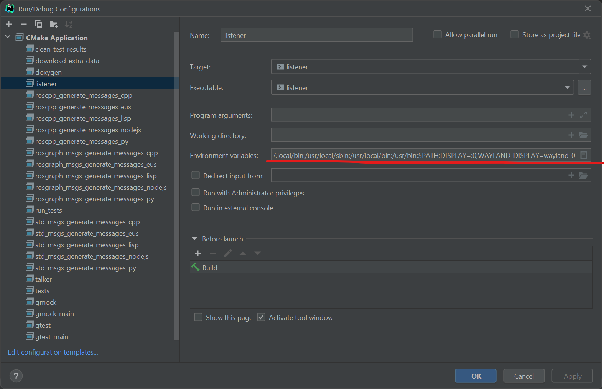

# 不用catkin，像正常c++一样写ROS

> 侯宇轩

+ 不用catkin
+ 不用source /opt/ros/xxx/setup.bash
+ 使用CMake
+ Clion能调试
+ Clion能远程调试

直接用g++编译同理
代码参考[官网教程:Writing a Simple Publisher and Subscriber (C++)](http://wiki.ros.org/ROS/Tutorials/WritingPublisherSubscriber%28c%2B%2B%29)

## 新建CMake

```cmake
cmake_minimum_required(VERSION 2.8.3)
project(no_catkin_write_ros)

## Find catkin and any catkin packages
find_package(catkin REQUIRED COMPONENTS roscpp rospy std_msgs genmsg)

## Declare a catkin package
catkin_package()

## Build talker and listener
include_directories(include ${catkin_INCLUDE_DIRS})

add_executable(talker talker.cpp)
target_link_libraries(talker ${catkin_LIBRARIES})

add_executable(listener listener.cpp)
target_link_libraries(listener ${catkin_LIBRARIES})
```

## talker.cpp和listener.cpp
同教程一样

## clion设置
1. （远程）终端输入env，查看CMAKE_PREFIX_PATH和LD_LIBRARY_PATH环境变量
2. File -> Settings -> Build, Execution, Deployment -> CMake，将CMAKE_PREFIX_PATH加到Environment中
    ```shell
    CMAKE_PREFIX_PATH=/opt/ros/noetic
    ```
   
3. 执行cmake，编译
4. 右上角Edit Configuration，对可执行程序（listener和talker）增加LD_LIBRARY_PATH环环境变量
    ```shell
    LD_LIBRARY_PATH=/opt/ros/noetic/lib
    ```
   
5. 开roscore，运行